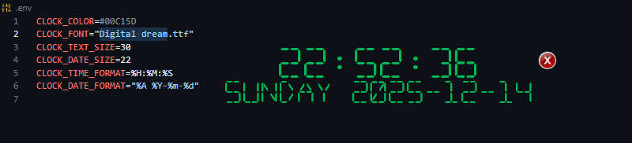

# 🕐 Digital Clock Application

A beautiful, customizable digital clock application built with Python and Tkinter. Features a transparent overlay design with custom fonts, drag-and-drop functionality, and cross-platform support.


## ✨ Features

- **🎨 Customizable Design**: Custom fonts, colors, and sizes
- **🖱️ Draggable Interface**: Click and drag to position anywhere on screen
- **👆 Hover Controls**: Exit button appears on hover for 3 seconds
- **🌈 Transparent Background**: Seamless desktop integration
- **🖥️ Always On Top**: Stays visible above other windows
- **📅 Date & Time Display**: Shows both time and date information
- **⚙️ Environment Configuration**: Customizable via .env file
- **🔧 Cross-Platform**: Works on Windows, macOS, and Linux

## 📸 Screenshots

| Default View | With Exit Button | Custom Font |
|--------------|------------------|-------------|
|  |  |  |

## 🚀 Quick Start

### Prerequisites

- Python 3.8 or higher
- pip (Python package manager)

### Installation

1. **Clone or Download the repository:**
   ```bash
   git clone https://github.com/AbdoPrDZ/Digital-Clock.git
   cd Digital-Clock
   ```

2. **Create virtual environment (recommended):**
   ```bash
   python -m venv .venv
   
   # Windows
   .venv\Scripts\activate
   
   # macOS/Linux
   source .venv/bin/activate
   ```

3. **Install dependencies:**
   ```bash
   pip install -r requirements.txt
   ```

4. **Run the application:**
   ```bash
   python src/main.py
   ```

## 📦 Building Executables

Choose the appropriate build script for your platform:

### Windows
```powershell
# PowerShell (recommended)
.\scripts\build.ps1

# Command Prompt
scripts\build.bat
```

### Linux/macOS
```bash
# Make executable and run
chmod +x scripts/build.sh
./scripts/build.sh

# macOS app bundle
python scripts/build-macos.py
```

### Cross-Platform
```bash
# Using Make (from scripts directory)
cd scripts
make build
make build-all  # All platforms
```

## ⚙️ Configuration

Create a `.env` file in the root directory to customize the clock:

```env
# Font settings
CLOCK_FONT=assets/DIGITALDREAM.ttf
CLOCK_TEXT_SIZE=30
CLOCK_DATE_SIZE=22

# Colors (hex format)
CLOCK_COLOR=#00C15D

# Time and date formats
CLOCK_TIME_FORMAT=%H:%M:%S
CLOCK_DATE_FORMAT=%A %Y-%m-%d
```

### Available Format Codes

| Code | Description | Example |
|------|-------------|---------|
| `%H` | Hour (24-hour) | 14 |
| `%I` | Hour (12-hour) | 02 |
| `%M` | Minute | 30 |
| `%S` | Second | 45 |
| `%A` | Full weekday | Monday |
| `%Y` | Year | 2025 |
| `%m` | Month | 12 |
| `%d` | Day | 14 |

## 🎨 Customization

### Fonts
1. Add your TTF font file to the `assets/` directory
2. Update `CLOCK_FONT` in `.env` to point to your font
3. Restart the application

### Colors
Use any hex color code in the `CLOCK_COLOR` setting:
- `#FF0000` - Red
- `#00FF00` - Green  
- `#0066CC` - Blue
- `#FFD700` - Gold

### Window Behavior
The clock is designed to be:
- **Always on top** of other windows
- **Draggable** by clicking and moving
- **Transparent** background for desktop integration
- **Hover-activated** exit button

## 🏗️ Project Structure

```
digital-clock/
├── src/
│   ├── main.py          # Main application file
│   ├── utils.py         # Utility functions
├── assets/
│   ├── DynaPuff.ttf     # Custom font file
│   ├── exit.png         # Exit button icon
│   └── icon.ico         # Windows application icon
├── scripts/
│   ├── build-macos.py   # macOS app bundle builder
│   ├── build.bat        # Windows batch build script
│   ├── build.ps1        # Windows PowerShell build script
│   ├── build.sh         # Linux/macOS bash build script
│   ├── Makefile         # Build automation
│   └── run.bat          # Windows run script
├── .env.example         # Configuration template
├── .editorconfig        # Editor configuration
├── .gitignore           # Git ignore rules
├── DigitalClock.spec    # PyInstaller spec file (auto-generated)
├── requirements.txt     # Python dependencies
└── README.md            # This file
```

## 🛠️ Development

### Setting up development environment:

```bash
# Clone repository
git clone https://github.com/AbdoPrDZ/Digital-Clock.git
cd Digital-Clock

# Create virtual environment
python -m venv .venv
source .venv/bin/activate  # Linux/macOS
# or
.venv\Scripts\activate     # Windows

# Install dependencies
pip install -r requirements.txt

# Run in development mode
python src/main.py
```

### Code Structure

- **`src/main.py`**: Main application with ClockApp class
- **`src/utils.py`**: Utility functions for fonts, assets, and images
- **Font registration**: Windows-specific font loading via GDI32 API
- **Asset management**: Centralized asset path handling
- **Configuration**: Environment-based settings

### Adding Features

1. **New time formats**: Modify `CLOCK_TIME_FORMAT` in config
2. **Additional widgets**: Extend the ClockApp class in `main.py`
3. **Custom themes**: Add new color schemes in configuration
4. **Platform features**: Extend platform-specific code in utils

## 📋 Requirements

### Python Packages
- `tkinter` - GUI framework (usually included with Python)
- `Pillow` - Image processing for icons
- `python-dotenv` - Environment variable management

### System Requirements
- **Windows**: Windows 7 or later
- **macOS**: macOS 10.12 or later  
- **Linux**: Any modern distribution with X11 or Wayland

### Optional Dependencies
- `pyinstaller` - For building standalone executables
- `watchdog` - For development auto-reload (make dev)

## 🤝 Contributing

1. Fork the repository
2. Create a feature branch (`git checkout -b feature/amazing-feature`)
3. Commit your changes (`git commit -m 'Add amazing feature'`)
4. Push to the branch (`git push origin feature/amazing-feature`)
5. Open a Pull Request

### Development Guidelines
- Follow PEP 8 style guidelines
- Add docstrings to new functions
- Test on multiple platforms when possible
- Update README for new features

## 📝 License

This project is licensed under the MIT License - see the [LICENSE](LICENSE) file for details.

## 🐛 Troubleshooting

### Common Issues

**Font not loading:**
- Ensure the font file exists in `assets/`
- Check the `CLOCK_FONT` path in `.env`
- Font registration requires admin rights on some systems

**Application won't start:**
- Check Python version (3.8+ required)
- Install missing dependencies: `pip install -r requirements.txt`
- Verify Tkinter installation: `python -c "import tkinter"`

**Build fails:**
- Ensure PyInstaller is installed: `pip install pyinstaller`
- Check asset paths are correct
- Run build script from project root directory

**Clock not draggable:**
- Ensure mouse events are properly bound
- Check for conflicting window managers on Linux

### Getting Help

1. Check the [Issues](https://github.com/AbdoPrDZ/digital-clock/issues) page
2. Create a new issue with:
   - Operating system and version
   - Python version
   - Error messages or screenshots
   - Steps to reproduce

## 🙏 Acknowledgments

- Font: [Digital Dream](https://www.dafont.com/digital-dream.font) by Tara Davis
- Icons: Custom designed for this project
- Inspiration: Various desktop clock applications

## 📊 Stats


---

<div align="center">
  <p>Made with ❤️ and Python</p>
  <p>⭐ Star this repository if you found it helpful!</p>
</div>
